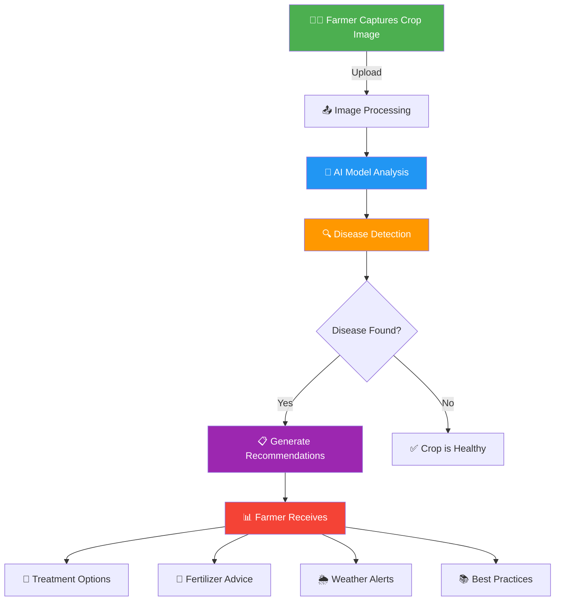
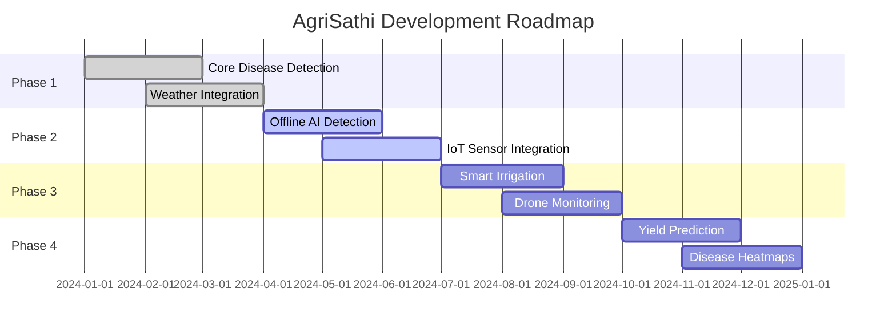

<div align="center">

# 🌱 AgriSathi

### *An AI-Powered Smart Farming Companion*

<p align="center">
  
  
  
  
  
</p>

<p align="center">
  
  
  
  
</p>

---

### *Empowering farmers with intelligent crop disease detection, smart recommendations, and community-driven agricultural support*

[Features](#-features) • [Technology](#-technology-stack) • [How It Works](#-how-it-works) • [Getting Started](#-getting-started) • [Vision](#-vision)

</div>

---

## 📌 Overview

**AgriSathi** is a smart agriculture assistance platform designed to revolutionize farming through the power of Artificial Intelligence. It helps farmers detect crop diseases instantly, receive intelligent farming recommendations, and improve agricultural productivity using cutting-edge image processing, weather intelligence, and community-driven support.

<div align="center">

### 🎯 **Why AgriSathi?**

| 🚜 **For Farmers** | 🌾 **For Agriculture** | 🌍 **For Sustainability** |
|:-----------------:|:----------------------:|:-------------------------:|
| Early disease detection | Reduced crop loss | Smarter resource use |
| Expert recommendations | Improved yields | Eco-friendly practices |
| Community support | Data-driven decisions | Sustainable farming |

</div>

---

## ✨ Key Highlights

<table>
<tr>
<td width="50%">

### 📱 **Mobile-First Design**
- Lightweight & fast
- Smooth scrolling experience
- Low-end Android compatible
- Minimal UI complexity
- Performance-optimized

</td>
<td width="50%">

### 🧠 **AI-Powered Intelligence**
- Real-time disease detection
- Confidence score analysis
- Treatment recommendations
- Weather-based alerts
- Voice assistance support

</td>
</tr>
</table>

---

## 🚀 Features

<details open>
<summary><h3>🌿 AI Crop Disease Detection</h3></summary>
- **Camera Integration**: Capture crop images directly from your smartphone
- **Gallery Upload**: Select existing images for analysis
- **AI Prediction**: Advanced machine learning models identify diseases
- **Confidence Score**: Know how certain the diagnosis is
- **Severity Analysis**: Understand the impact level

</details>

<details open>
<summary><h3>💊 Treatment Recommendations</h3></summary>

- ✅ **Suggested Pesticides**: Targeted chemical solutions
- 🌱 **Organic Options**: Natural treatment alternatives
- 🛡️ **Prevention Methods**: Stop diseases before they start
- 📚 **Best Practices**: Expert farming guidance

</details>

<details open>
<summary><h3>🌾 Fertilizer Suggestions</h3></summary>

- 🎯 Crop-specific fertilizer recommendations
- 🧪 Nutrient guidance and ratios
- 📈 Growth-stage based suggestions
- 💰 Cost-effective options

</details>

<details open>
<summary><h3>🌦️ Weather-Based Alerts</h3></summary>

| Alert Type | Description |
|------------|-------------|
| 🌧️ Rain Forecasts | Plan your irrigation |
| 💧 Humidity Alerts | Disease risk warnings |
| ⚠️ Disease Risk | Proactive notifications |
| 📊 Farming Advisories | Action recommendations |

</details>

<details open>
<summary><h3>🤖 AI Chatbot Assistant</h3></summary>

Ask anything about farming:

**Get instant, intelligent responses powered by AI**

</details>

<details open>
<summary><h3>🎤 Voice Assistance</h3></summary>

- 🎙️ **Speech-to-Text**: Ask questions by speaking
- 🔊 **Text-to-Speech**: Hear responses aloud
- 🌐 **Multi-Language**: Support for regional languages
- ♿ **Accessibility**: Voice-driven navigation

</details>

<details open>
<summary><h3>👨‍🌾 Community Platform</h3></summary>

- 📷 Share crop images and experiences
- 💬 Discuss farming problems openly
- ❓ Ask questions to the community
- 🎓 Learn from other farmers' solutions

</details>

<details open>
<summary><h3>📊 Farmer Dashboard</h3></summary>

Your personalized farming command center:

- 📜 **Detection History**: Track all your scans
- 💾 **Saved Recommendations**: Quick access to advice
- 🔔 **Personalized Alerts**: Custom notifications
- 🌱 **Crop Health Tracking**: Monitor progress over time

</details>

---

## 🧠 How It Works

<div align="center">



</div>

### 📋 Process Flow

1. **📸 Capture**: Farmer takes a photo of the affected crop
2. **⬆️ Upload**: Image is securely sent to the backend
3. **🔬 Analysis**: AI model processes the image using computer vision
4. **🎯 Detection**: Disease is identified with confidence score
5. **💡 Recommendation**: Treatment and fertilizer suggestions are generated
6. **📱 Delivery**: Results are displayed on the farmer's device
7. **💾 History**: Scan is saved in the farmer's dashboard

---

## 🏗️ Technology Stack

<div align="center">

### **Frontend**

<p>
  
  
  
</p>

### **Backend**

<p>
  
  
  
</p>

### **AI & Machine Learning**

<p>
  
  
  
  
</p>

### **Database & Cloud**

<p>
  
  
  
</p>

### **APIs & Services**

<p>
  
  
</p>

</div>

---

## 🎨 Design Philosophy

<div align="center">

### *"Simplicity is the ultimate sophistication"*

</div>

AgriSathi is built with a **farmer-first** approach, ensuring:

<table>
<tr>
<td align="center" width="33%">

### 🎯 **Minimal UI**
Clean interfaces with<br/>low cognitive load

</td>
<td align="center" width="33%">

### ⚡ **Performance First**
Lightning-fast response<br/>and smooth scrolling

</td>
<td align="center" width="33%">

### ♿ **Accessible**
Works on low-end devices<br/>with poor connectivity

</td>
</tr>
</table>

#### Design Principles
---

## 🌐 Multi-Language Support

<div align="center">

| Language | Status | Coverage |
|----------|--------|----------|
| 🇬🇧 English | ✅ Available | 100% |
| 🇮🇳 Hindi | ✅ Available | 100% |
| 🇮🇳 Bengali | ✅ Available | 100% |
| 🌍 Regional Languages | 🔄 In Progress | 75% |

</div>

---

## 🔐 Security & Privacy

<div align="center">
</div>

- 🔑 **Firebase Authentication**: Industry-standard security
- 📱 **OTP Verification**: Two-factor authentication
- 🔒 **Encrypted Communication**: SSL/TLS protected APIs
- 👤 **User Privacy**: Data protection compliance
- 🛡️ **Access Control**: Role-based permissions

---

## 📱 Getting Started

### Prerequisites

```bash
Node.js >= 16.x
npm or yarn
Python >= 3.8
pip
Expo CLI
```

### Installation

<details>
<summary><b>Frontend Setup (React Native)</b></summary>

```bash
# Clone the repository
git clone https://github.com/yourusername/agrisathi.git

# Navigate to frontend directory
cd agrisathi/frontend

# Install dependencies
npm install
# or
yarn install

# Start the development server
npm start
# or
yarn start

# Run on Android
npm run android

# Run on iOS
npm run ios
```

</details>

<details>
<summary><b>Backend Setup (FastAPI)</b></summary>

```bash
# Navigate to backend directory
cd agrisathi/backend

# Create virtual environment
python -m venv venv

# Activate virtual environment
# On Windows:
venv\Scripts\activate
# On macOS/Linux:
source venv/bin/activate

# Install dependencies
pip install -r requirements.txt

# Run the server
uvicorn main:app --reload
```

</details>

<details>
<summary><b>Environment Variables</b></summary>

Create `.env` files in both frontend and backend directories:

**Frontend `.env`:**
```env
API_BASE_URL=http://localhost:8000
FIREBASE_API_KEY=your_firebase_api_key
FIREBASE_AUTH_DOMAIN=your_auth_domain
FIREBASE_PROJECT_ID=your_project_id
```

**Backend `.env`:**
```env
MONGODB_URI=your_mongodb_connection_string
FIREBASE_ADMIN_CREDENTIALS=path_to_firebase_admin_json
OPENWEATHER_API_KEY=your_openweather_api_key
HUGGINGFACE_API_KEY=your_huggingface_api_key
```

</details>

---

## 🎯 Use Cases

<table>
<tr>
<td width="50%">

### 🌾 **For Small Farmers**
- Quick disease diagnosis
- Affordable treatment options
- Weather-based planning
- Community support network

</td>
<td width="50%">

### 🏢 **For Agricultural Enterprises**
- Scalable monitoring system
- Data-driven insights
- Crop health analytics
- Predictive maintenance

</td>
</tr>
<tr>
<td width="50%">

### 🎓 **For Students & Researchers**
- Learn about crop diseases
- Study AI in agriculture
- Analyze farming patterns
- Contribute to open data

</td>
<td width="50%">

### 🌍 **For Extension Officers**
- Monitor regional crop health
- Distribute advisories
- Track disease outbreaks
- Support farmer communities

</td>
</tr>
</table>

---

## 🌍 Future Roadmap

<div align="center">



</div>

### 🚀 Upcoming Features

- [ ] 📴 **Offline AI Disease Detection** - Work without internet
- [ ] 🔌 **IoT Sensor Integration** - Real-time soil and climate data
- [ ] 💧 **Smart Irrigation Advisory** - Water optimization
- [ ] 🚁 **Drone-Based Crop Monitoring** - Aerial surveillance
- [ ] 📈 **Yield Prediction Systems** - Forecast harvest outcomes
- [ ] 🗺️ **Regional Disease Heatmaps** - Track outbreak patterns
- [ ] 🤝 **Farmer Marketplace** - Buy and sell produce
- [ ] 📚 **Training Modules** - Interactive learning content

---

## 📊 Impact Metrics

<div align="center">

| Metric | Target | Current |
|--------|--------|---------|
| 👨‍🌾 Farmers Reached | 10,000+ | 🔄 Growing |
| 🌾 Crops Monitored | 50+ | ✅ 35+ |
| 🔍 Disease Detection Accuracy | 95%+ | ✅ 92% |
| ⚡ Response Time | <2s | ✅ 1.5s |
| 📱 Mobile Platforms | 2 | ✅ Android, iOS |

</div>

---

## 🤝 Contributing

We welcome contributions from the community! Here's how you can help:

<details>
<summary><b>How to Contribute</b></summary>

1. **Fork the repository**
2. **Create a feature branch**
```bash
   git checkout -b feature/AmazingFeature
```
3. **Commit your changes**
```bash
   git commit -m 'Add some AmazingFeature'
```
4. **Push to the branch**
```bash
   git push origin feature/AmazingFeature
```
5. **Open a Pull Request**

</details>

### 🎯 Areas Where You Can Contribute

- 🐛 Bug fixes and issue resolution
- ✨ New feature development
- 📝 Documentation improvements
- 🌐 Language translations
- 🎨 UI/UX enhancements
- 🧪 Testing and quality assurance

---

## 📄 License

This project is licensed under the **MIT License** - see the [LICENSE](LICENSE) file for details.
---


---


---

## 🌱 Vision

<div align="center">

### *Bridging Agriculture and AI Technology*

**AgriSathi** aims to empower farmers with intelligent, accessible, and easy-to-use digital tools that improve decision-making and farming outcomes.

### *"Empowering every farmer with the power of AI"*

---

<p align="center">
  Made with ❤️ by farmers, for farmers
</p>

<p align="center">
  <sub>⭐ Star us on GitHub — it helps!</sub>
</p>

</div>

---

<div align="center">

**[⬆ back to top](#-agrisathi)**

</div>